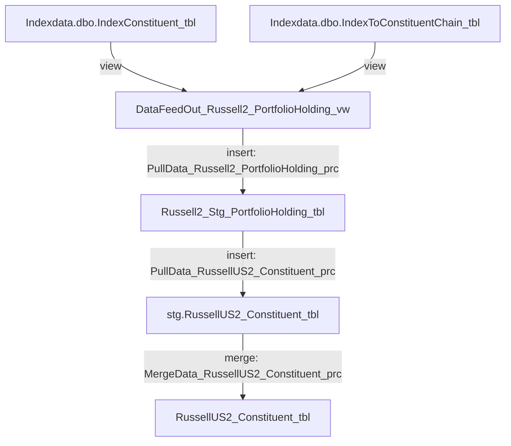

# RussellUS2_Constituent_tbl data lineage

```mermaid
flowchart TD
   D1[Indexdata.dbo.IndexConstituent_tbl]
   D2[Indexdata.dbo.IndexToConstituentChain_tbl]
   D[DataFeedOut_Russell2_PortfolioHolding_vw]
   E[Russell2_Stg_PortfolioHolding_tbl]
   F[stg.RussellUS2_Constituent_tbl]
   D1-->|view|D
   D2-->|view|D
   D-->|insert: PullData_Russell2_PortfolioHolding_prc|E
   E-->|insert: PullData_RussellUS2_Constituent_prc|F
   F-->|merge: MergeData_RussellUS2_Constituent_prc| G[RussellUS2_Constituent_tbl]

  
```
